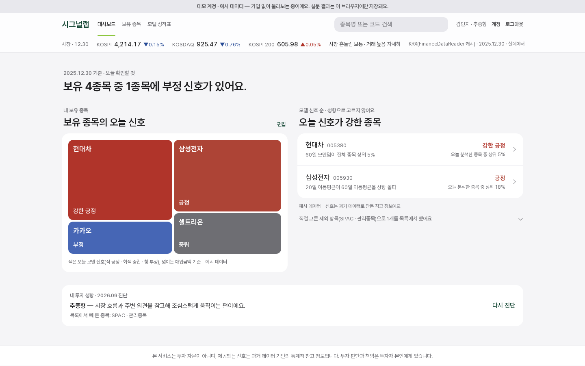
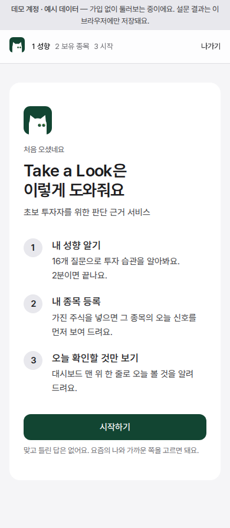
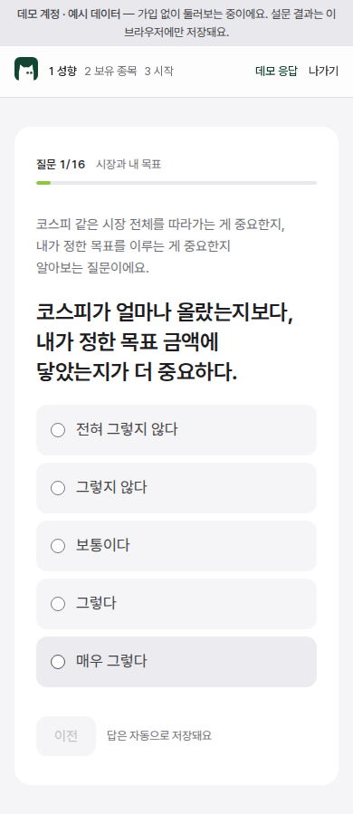
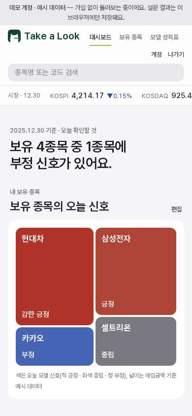
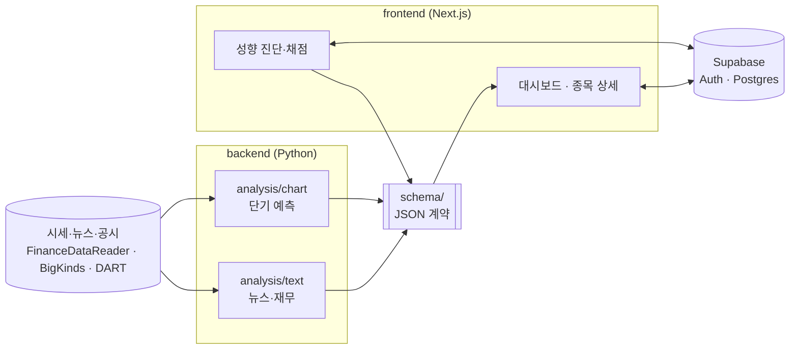

# 시그널랩 (SignalLab)

**초보 투자자가 종목을 판단할 근거를 쉽게 보여 주는 서비스.**
투자 성향을 진단해 근거를 보여 주는 순서를 사람마다 다르게 하고, 주가 예측 모델은 여러 근거 중 하나로만 씁니다.

[](https://github.com/2026Graduation-Work/Stock_Prediction_v2/actions/workflows/web-ci.yml)
[](https://github.com/2026Graduation-Work/Stock_Prediction_v2/actions/workflows/python-ci.yml)
[](LICENSE)

**라이브 데모 → https://stock-prediction-v2-chi.vercel.app** (가입 없이 "데모로 둘러보기"로 모든 화면을 볼 수 있습니다)

<p>
  
</p>

## 무엇을 하나

- **성향 진단** — 16문항(8축) 진단으로 투자 유형을 정합니다. 더 정확히 하고 싶으면 24문항 진단도 있습니다.
- **성향에 맞춘 근거** — 종목마다 네 가지 근거(시장 분위기 · 누가 사고팔았나 · 회사 체력 · 모델이 본 이유)를 성향에 맞는 순서와 체크포인트로 보여 줍니다. 종목을 걸러 내지는 않습니다.
- **설명 가능한 숫자** — 모든 수치에 비교 기준과 출처를 붙입니다. "상승 확률 70%" 대신 "과거 비슷한 경우 10번 중 7번은 이 범위였어요"처럼 말하고, 미래 가격 곡선은 그리지 않습니다.
- **대시보드** — 맨 위 한 줄로 "오늘 확인할 것"을 알려 주고, 보유 종목 맵과 신호가 강한 종목을 보여 줍니다.

<p>
  
  
  
</p>

### 설계 원칙

- **화이트박스**: 점수는 전부 규칙으로 계산합니다(결정론). LLM은 설명 문장에만 씁니다.
- **사람이 결정**: 매수·매도 지시나 자동 매매는 하지 않습니다. 근거와 출처를 보여 주고 판단은 사용자가 합니다.
- **데이터 정직성**: 실데이터가 아닌 값에는 화면에 "예시 데이터"를 표시합니다. 어떤 수치가 실데이터인지는 [docs/data-inventory.md](docs/data-inventory.md)에 있습니다.

## 빠르게 시작하기

### 웹 앱 실행

Node 22 이상과 pnpm이 필요합니다.

```bash
git clone https://github.com/2026Graduation-Work/Stock_Prediction_v2.git
cd Stock_Prediction_v2/frontend
pnpm install
cp .env.example .env.local
pnpm dev   # http://localhost:3000
```

환경변수 없이도 데모 계정으로 모든 화면이 동작합니다. 이메일 가입·로그인을 쓰려면 `.env.local`에 Supabase URL과 anon 키를 넣고 [docs/auth-setup.md](docs/auth-setup.md)대로 DB를 준비하세요(마이그레이션: `supabase/migrations/`).

### 테스트

```bash
# frontend/
pnpm lint && npx tsc --noEmit && pnpm test:unit && pnpm build && pnpm test:e2e

# 파이썬 블록 (Python 3.12, 각 블록 디렉토리에서)
pip install -r requirements.txt   # profiling/survey는 requirements-dev.txt
ruff check . && pytest
```

### 분석 블록 실행

모델 학습·추론과 뉴스·재무 분석은 블록별 문서를 따릅니다.

| 블록 | 하는 일 | 문서 |
|---|---|---|
| `backend/analysis/chart` | 가격·거래량 피처 + LightGBM 단기 예측, 백테스트 | [ONBOARDING.md](backend/analysis/chart/ONBOARDING.md) |
| `backend/analysis/text` | 뉴스 감성(과거 BigKinds · 최근 NewsAPI.ai, KR-FinBERT)·재무(DART) 분석 | [README](backend/analysis/text/README.md) |
| `backend/profiling` | 성향 설문 정의와 출력 스키마 | [README](backend/profiling/README.md) |

API 키(`DART_API_KEY`, `NEWSAPI_AI_KEY` 등)는 저장소 루트의 `.env`에 둡니다. `.env`는 gitignore되어 있으니 절대 커밋하지 마세요.

## 구조



```
backend/
  analysis/chart/   단기 예측 모델, 공용 평가·백테스트
  analysis/text/    뉴스 감성·재무 분석 파이프라인
  profiling/        성향 설문 정의
frontend/           Next.js 웹 앱 (화면 규칙: frontend/DESIGN.md)
schema/             블록 사이 JSON 계약 (버전 고정, 변경은 팀 합의)
supabase/           DB 마이그레이션·시드
docs/               설계·데이터·설정 문서 (색인: docs/README.md)
```

- 별도 API 서버 없이 프론트가 Supabase를 직접 조회하고, 블록 사이는 `schema/`의 JSON 스키마로만 주고받습니다.
- 새 데이터 소스나 모델을 붙이려면 해당 스키마를 맞춰 출력하면 화면에 그대로 연결됩니다.

**기술 스택**: Next.js 16 · React 19 · TypeScript · Tailwind CSS v4 · Recharts · Supabase · Vercel / Python · LightGBM · KR-FinBERT · FinanceDataReader

## 기여하기

브랜치·커밋·PR 규칙은 [docs/CONTRIBUTING.md](docs/CONTRIBUTING.md), 아키텍처 원칙과 금지 표현은 [AGENTS.md](AGENTS.md)에 있습니다. 보안 문제는 [SECURITY.md](SECURITY.md)를 봐 주세요.

## 팀

성균관대학교 소프트웨어학과 2026학년도 졸업작품

| 블록 | 담당 |
|---|---|
| `backend/profiling` · 스키마 | 최중현 |
| `backend/analysis/chart` | 서진세 |
| `backend/analysis/text` | 김서환 |
| `frontend` · 인프라 | 임성우 |

## 라이선스

[MIT](LICENSE)

> 시그널랩은 투자 자문이 아닙니다. 모든 신호는 과거 데이터에 기반한 통계적 참고 정보이며, 투자 판단과 책임은 사용자에게 있습니다.
