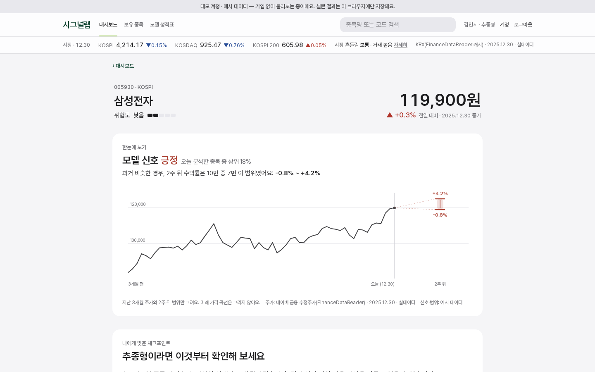
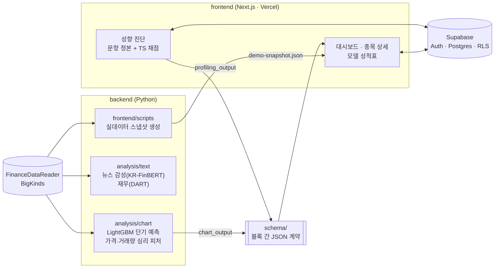

# 시그널랩 (Stock-Prediction v2)

**초보 투자자가 종목을 판단할 근거를 쉽게 보여 주는 서비스.** 투자 성향을 진단해 정보를 보여 주는 순서와 확인할 점을 개인화하고, 예측 모델은 여러 근거 중 하나로 둡니다.

성균관대학교 소프트웨어학과 2026학년도 졸업작품 · 행동재무학 기반 심리 지수 반영 주가 예측 플랫폼

## 라이브 데모

**https://stock-prediction-v2-chi.vercel.app**

- **데모로 둘러보기**: 가입 없이 예시 사용자(김민지)로 모든 화면을 볼 수 있어요. 진단 결과는 그 브라우저에만 저장됩니다. 화면 맨 위에 "데모 계정 · 예시 데이터"가 표시됩니다.
- **이메일로 시작**: 가입하면 성향과 보유 종목이 계정(Supabase)에 저장됩니다. 설정 상태는 [docs/auth-setup.md](docs/auth-setup.md).

<p>
  
</p>

## 핵심 기능

1. **오늘 확인할 것 한 줄** — 대시보드 맨 위에 결정론 문장("보유 4종목 중 1종목에 부정 신호가 있어요.")으로 답합니다. 아래에 내 보유 종목 맵과 모델 신호가 강한 종목 목록.
2. **성향에 맞춘 근거 순서** — 16문항 성향 진단(8축)으로 투자 유형을 정하고, 종목 상세의 판단 근거 4가지(시장 분위기 · 누가 사고팔았나 · 회사 체력 · 모델이 본 이유)의 순서와 체크포인트를 유형에 맞춥니다. 종목을 거르지 않습니다(소프트 틸트).
3. **화이트박스 근거** — 모든 수치에 비교 기준·구간 말·출처가 붙습니다. "상승 확률 70%" 대신 "과거 비슷한 경우, 2주 뒤 수익률은 10번 중 7번 이 범위였어요". 미래 가격 곡선은 그리지 않습니다.

<p>
  
</p>

## 처음 온 사람의 흐름

```
로그인 → 환영 1장 → 성향 진단(16문항, 한 화면 한 문항) → 결과 확인 → 보유 종목(있어요/아직 없어요) → 대시보드
```

돌아온 사용자는 바로 대시보드로 갑니다. 결과 화면에서 24문항으로 더 정확하게 진단할 수 있고, 헤더 계정 메뉴에서 다시 진단·보유 종목 편집을 할 수 있어요.

<p>
  
  
  
</p>

## 시스템 구조



- 프론트가 Supabase를 직접 조회합니다(별도 API 서버 없음). 스키마가 곧 API 계약입니다.
- 점수 산출은 100% 결정론이고, LLM은 설명 문장에만 씁니다.

## 데이터 경계 (실데이터 vs 예시)

화면의 43개 수치를 한 행씩 분류한 원본은 [docs/data-inventory.md](docs/data-inventory.md)입니다. 기준일은 **2025-12-30**.

| 실데이터 | 예시(화면에 "예시 데이터" 표시) |
|---|---|
| 시장 브리핑 지수(KOSPI·KOSDAQ·KOSPI 200, KRX) · 시장 흔들림/거래 구간 | 모델 신호·순위·수익률 범위·상승 비율 (재학습 전, #107) |
| 데모 4종목 시세·주가 흐름·가격 흔들림(네이버 금융 수정주가) | 수급(KRX 계정 필요) · 재무 6지표(DART 키 필요) |
| 가격 흐름으로 본 분위기(가격·거래량 심리 피처) | 삼성전자 외 뉴스 분위기 · 모델 근거 문장 |
| 삼성전자 뉴스 분위기(BigKinds 8,920건 × KR-FinBERT) | 모델 성적표(실험 결과 반영 전) |
| 사용자가 직접 답한 성향 · 직접 입력한 보유 종목 | |

## 기술 스택

- **Web**: Next.js 16 (App Router) · React 19 · TypeScript · Tailwind CSS v4 · Recharts · Vercel
- **DB·인증**: Supabase (PostgreSQL, Row Level Security, 이메일 인증)
- **모델**: LightGBM(GBDT) 단기 예측 · 가격·거래량 심리 피처(psychology_market_v1) · KR-FinBERT 뉴스 감성
- **데이터**: FinanceDataReader(네이버 금융·KRX 캐시) · BigKinds · DART Open API
- **품질**: ESLint · Node test runner · Playwright e2e · pytest · ruff · GitHub Actions · CodeQL

## 디자인 시스템

- **성균관대학교 공식 색**(skku.edu 성대 UI > 심볼마크 > 성대 COLOR)을 색만 씁니다. 성균 진녹 #124532(버튼·링크·현재 위치), 성균 연두 #8DC63F(선택 표시·진행률), 성균 주황 #FF6C0F(주의 점). 교표·심볼마크 이미지는 쓰지 않습니다.
- 규칙 한 줄: **한 화면에서 색이 있는 것은 가격 방향(상승 적 · 하락 청)과 초록 버튼 하나가 전부다.** 애플 웹 톤의 무채색, 테두리 대신 면, 본문 15px.
- 판단 규칙은 [frontend/DESIGN.md](frontend/DESIGN.md), 값(색·글자·모서리)은 [frontend/app/globals.css](frontend/app/globals.css)의 `@theme`가 기준입니다.
- 사용한 디자인 스킬(원본 레포에서 검토 후 고정, 우선순위는 AGENTS.md > DESIGN.md > 스킬): taste-skill의 `redesign-existing-projects`·`minimalist-ui`, ui-skills의 `baseline-ui`·`fixing-motion-performance`. 목록과 판정표는 [.claude/skills/README.md](.claude/skills/README.md).

## 로컬 실행

```bash
# 프론트엔드 (Node 24, pnpm)
cd frontend
pnpm install
cp .env.example .env.local   # Supabase 값이 없으면 데모 계정만 동작
pnpm dev                     # http://localhost:3000

# 검증
pnpm lint && npx tsc --noEmit && pnpm test:unit && pnpm build && pnpm test:e2e
```

```bash
# 파이썬 블록 (각 블록 디렉토리 기준)
pip install -r backend/profiling/survey/requirements-dev.txt
ruff check . && pytest

# 실데이터 스냅샷 다시 만들기 (저장소 루트)
pip install finance-datareader pandas numpy
python frontend/scripts/build_demo_snapshot.py
```

## 팀·역할

| 블록 | 담당 | 역할 |
|---|---|---|
| `backend/profiling` | 중현 | 사용자 내부 정보 — 설문, JSON 스키마 |
| `backend/analysis/chart` | 진세 | 차트 패턴 분석(기술적 분석, DT 계열 모델) |
| `backend/analysis/text` | 서환 | 뉴스 감성·재무제표 분석 |
| `frontend` | 성우 | 기능 명세, 대시보드, 인프라 |

## 문서

- [AGENTS.md](AGENTS.md) — 프로젝트 정의·아키텍처 원칙·표현 규칙·금지사항(코딩 에이전트 공통 지침)
- [docs/README.md](docs/README.md) — 문서 색인
- [docs/data-inventory.md](docs/data-inventory.md) — 화면 수치별 출처와 실데이터 여부
- [docs/auth-setup.md](docs/auth-setup.md) — 계정 로그인 설정
- [docs/erd.md](docs/erd.md) — Supabase 테이블
- [frontend/DESIGN.md](frontend/DESIGN.md) — 화면 규칙
- [schema/](schema/) — 블록 간 JSON 계약(v1.x freeze)

본 서비스는 투자 자문이 아니며, 신호는 과거 데이터 기반의 통계적 참고 정보입니다. 자동 매매를 하지 않고 최종 판단은 사용자가 합니다.
