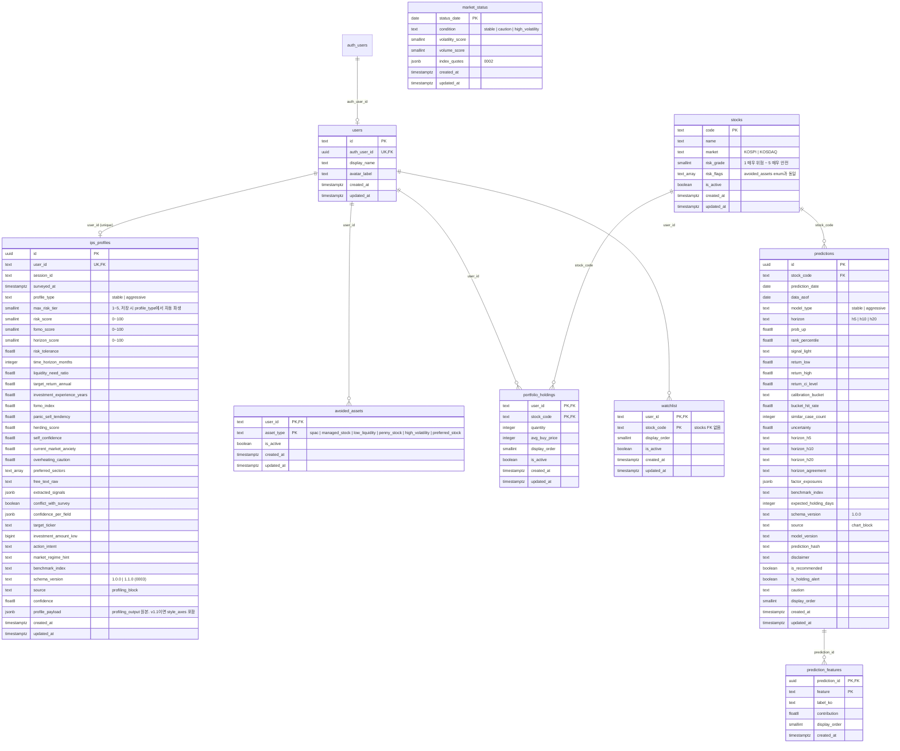

# Supabase ERD

`supabase/migrations/` 0001~0003 기준. 스키마가 바뀌면 이 문서와 `frontend/lib/types.ts`를 함께 고친다.

> 0003(schema_version `1.1.0` 허용)은 아직 미적용이다. 적용 전 담당자 확인이 필요하다.
> 8축은 별도 컬럼 없이 `profile_payload.style_axes`에 저장하므로 0003 없이도 앱은 동작한다(8축만 null).



## `ips_profiles.profile_payload.style_axes` 형태

`schema/profiling_output.schema.json` v1.1 `style_axes` ↔ `frontend/lib/types.ts` `StyleAxes`.

```json
{
  "assessment_mode": "quick | detailed",
  "axes": [
    { "axis_id": "turnover", "ratio": -0.25, "confidence": 0.95, "answered_count": 3, "question_count": 3 }
  ]
}
```

- `axes`는 8축을 모두 담는다: `market_participation`, `loss_tolerance`, `turnover`, `concentration`,
  `rule_adherence`, `information_reliance`, `urgency`, `drawdown_reaction`.
- `ratio` -1~+1, `confidence` 0~1. 극성은 `frontend/lib/profiling/style-questions.json` `axes`가 SSOT다.
- `rule_adherence`는 -1이 사전 규칙 준수, +1이 상황별 재량이다. 이름과 극성 방향이 반대로 읽히니 주의한다.
